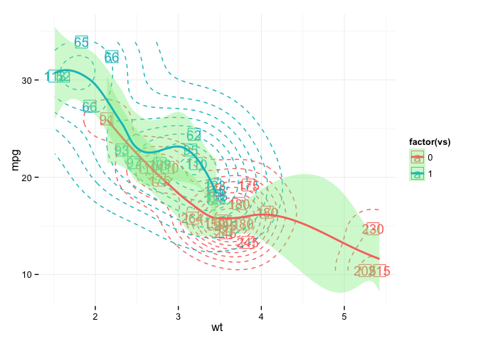

# 用ggplot绘图（一）
 

# 引言
ggplot 是一个2D绘图的绘图库，和大部分市面上的大部分免费的绘图工具一样，ggplot仅提供2D。同时，ggplot2的学习成本也比一般的绘图库要高，花两倍于正常绘图软件的时间，你可能连基本的绘图都不能随心所欲。那么为什么还要大费周章的再学习ggplot呢？

下面是几个可能的理由：

1. ggplot是一套自洽的体系。ggplot是一个图形设计语言的实现，在设计的开始就保证了功能直接的协调和统一。因此，你不会需要记住很多特殊的功能和选项，所有的东西都归纳到了语言的本身设计之中。
1. 结构统一。自洽的体系给ggplot带来的是所有图像都有统一的结构和框架。一旦你掌握了这个语言的框架，你就会发现你需要做得只是告诉ggplot你需要怎么展示数据，而ggplot就能将你的数据按照需要的方式展示出来。
1. 架构合理。通过将2D绘图抽象为一套语言，ggplot将一些其他绘图库不易整合的功能轻易的整合在一起。比如，ggplot的主题切换仅仅需要添加一个参数；将ggplot按照不同的变量分割为不同的曲线或者面板也仅仅需要修改一个选项或者添加一个层。这些在其他绘图库中往往意味着你需要重新开始构造你的图像。
1. 出图优雅。我已经不能用优美来形容ggplot了，这是因为ggplot的架构导致其将绘图的艺术成分和结构成分分离开来。因此，最终的图像内容取决于你的结构，这些和你的艺术设计没有关系；然而，最终的出图效果则取决于你的模板，而你可以按照你的意愿去制作自己的模板。这样的分离使得为ggplot提供优秀的模板是可能的，而不像其他绘图库，你基本需要为每种图像提供一个模板。
1. 细节无关。这几乎是ggplot最令人不可思议的地方，前面只说到ggplot结构统一，架构合理，出图优雅，体系自洽，但是这样的系统可能会需要你关注各种细节。比如，Origin Lab的程序也有这些优点，但是你必须关注到绘图的各种细节才能获得你想要的效果。然而，ggplot几乎将所有绘图的细节都隐藏了，你需要做得仅仅是告诉ggplot，我要绘制的数据是什么，我需要对数据做什么样的变换，我需要按照什么形式来显示，用什么样的模板来显示等等描述性的内容。至于ggplot怎么具体的将这些内容显示出来，这些细节已经完全隐藏起来了。而且，实际上一个人绘制图像的时候这些细节根本就是无关紧要的。
1. 烧脑。ggplot和通常的绘图库差别很大，完成一幅图像更像是写一个程序，完成一个模型。对于喜欢抽象模型和结构的人，ggplot绝对是你绘图的不二选择。

总之，如果你需要绘制复杂的数据的可视化结果，你喜欢简洁、高效、统一、优美、抽象层次高的工作，ggplot是你绘图的最佳伴侣。实际上，有很多其他的库也在模仿实现ggplot实现的图形设计语言，其中就有最近火热的ggvis。如果你对ggplot的概念了解的话，ggvis基本可以看作是ggplot的另外一个实现和扩展。说了那么多，为什么还不开始我们的旅途呢？那么让我们开始吧！

# 关于ggplot的语言的题外话

2005年Springer出版了由Wilkinson创作的《The Grammar of Graphics》，该书的细节内容可以参考篇末的参考书目。书中设计了一套图形设计的语法，认为可以按照语言的方式来绘制图形。ggplot2是一套基于这套语法设计的绘图库，该语法的要义在于认为图形是由很多独立的组件构成，而每个组件可以有多种不同的形式。正是作者体会到了这些图形组件是独立的，而且可以各种各样的表现出来，才使得ggplot成为了一套与原先的绘图库迥异的绘图库。ggplot里面独立组件的搭配几乎是任意的，而且你还可以自己编写你需要的组件。因此，要想掌握ggplot的方法，就是去了解这套组件，并放开的你想象力去产生出最适合的表示数据的形式。

# 踏上旅途

如果你看到这里的话，我相信你对ggplot已经很有兴趣了。那么，让我们开始脚踏实地的学习ggplot吧！

不过，我的这个系列文章不会从`qplot`开始，因为我不赞同从`qplot`来介绍ggplot。虽然`qplot`更简单，也更接近于其他绘图库的语法，但是正如前面所述，如果ggplot只是另一个绘图库的话，你完全没有必要来学习它。ggplot的特殊之处正在于它是基于一套图形设计的语法，而这套语法要从`aes`函数说起。

# 参考资料

- Chang, W. (2013). R Graphics Cookbook. O’Reilly Media, Incorporated. 
- Lamp, G. (2013). ggplot for Python. http://ggplot.yhathq.com
- Wickham, H. (2009). ggplot2: Elegant Graphics for Data Analysis. Springer. 
- Wickham, H. (2010). A Layered Grammar of Graphics. Journal of Computational and Graphical Statistics. 
- Wilkinson, L., & Wills, G. (2005). The Grammar of Graphics. Springer. 
